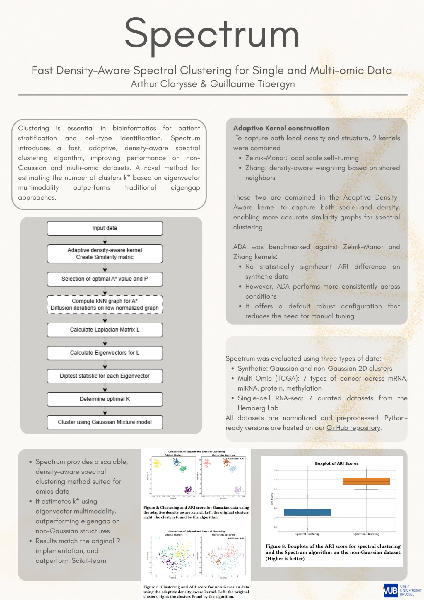

# Spectrum: A Fast, Density-Aware Spectral Clustering Algorithm for Single- and Multi-Omic Data
## Team
- **Arthur Clarysse** - 0616411
- **Guilaume Tibergyn** - 0618147

## Abstract
Clustering is a fundamental task in machine learning and bioinformatics. The goal is to group objects so that those in the same cluster are more similar to each other than to those in different clusters.
In biomedical science, clustering is central to applications such as precision medicine, where patients are grouped based on genome-wide expression data, or identifying cell types where single-cell RNA-sequencing is used and cells are clustered based on their transcriptomes.
However, clustering biomedical data poses several challenges: datasets can be massive, exhibit dense and globular cluster structures, or contain high-dimensional features. Furthermore, many clustering algorithms require the number of clusters to be specified a priori, which is often unknown in practice.
In this paper, we implement Spectrum, a fast, density-aware spectral clustering algorithm designed for single- and multi-omic data, based on the method proposed by John et al.
Spectrum employs an adaptive density-aware kernel that integrates the Zelnik-Manor and Zhang kernels, enabling it to capture non-Gaussian cluster structures better.
To address the unknown number of clusters, we incorporate a method to estimate the optimal number of clusters, $k^*$, based on the multimodality of eigenvectors. We compare this approach with the traditional eigengap method and demonstrate that the multimodality criterion yields superior performance on non-Gaussian datasets.
We benchmark the Spectrum implementation against the scikit-learn spectral clustering algorithm, showing that Spectrum achieves more accurate and robust clustering, particularly for complex data distributions. Additionally, our Python implementation reproduces the results of the original R-based version, validating its correctness.
Finally, we confirm that the choice of kernel significantly impacts performance and that the adaptive density-aware kernel offers notable advantages.
Our implementation and experimental results are publicly available on this GitHub page.

A demo of the algorithm is available [here](./Demo.ipynb), the standalone kernels are available in [kernels.py](./Kernels.py).

## Poster

